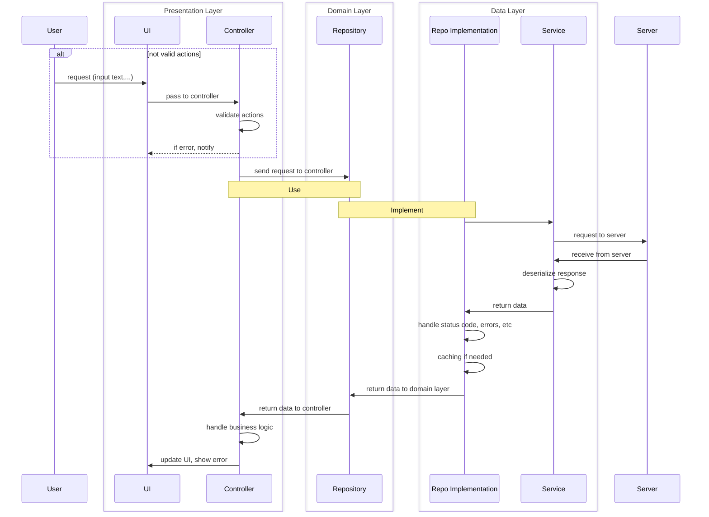

```mermaid
sequenceDiagram
    participant User

    box Presentation Layer
    participant UI as UI
    participant Controller as Controller
    end

    box Domain Layer
    participant REPO as Repository
    end

    box Data Layer
    participant RepoImpl as Repo Implementation
    participant SV as Service
    end

    participant BE as Server

    alt not valid actions
    User ->> UI: request (input text,...)
    UI ->> Controller: pass to controller
    Controller->>Controller: validate actions
    Controller -->> UI: if error, notify
    end
    
    Controller->>REPO: send request to controller

    Note over Controller, REPO: Use
    Note over RepoImpl, REPO: Implement

    RepoImpl->>SV: 
    SV->>BE: request to server
    BE->>SV: receive from server
    SV->>SV: deserialize response
    SV->>RepoImpl: return data
    RepoImpl->>RepoImpl: handle status code, errors, etc
    RepoImpl->>RepoImpl: caching if needed
    RepoImpl->>REPO: return data to domain layer
    REPO->>Controller: return data to controller
    Controller->>Controller: handle business logic
    Controller->>UI: update UI, show error
```
