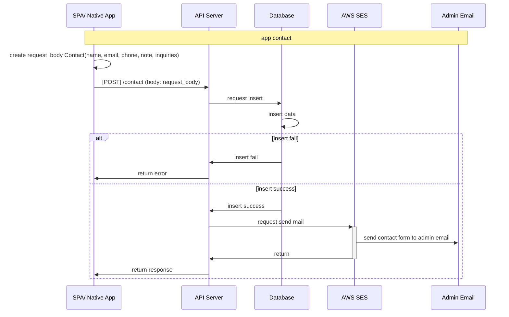

```mermaid
sequenceDiagram    

    participant Webapp as SPA/ Native App
    participant Server as API Server 
    participant DB as Database
    participant AS as AWS SES
    participant AE as Admin Email
    
    Note over Webapp, AE: app contact


    
    Webapp->>Webapp: create request_body Contact(name, email, phone, note, inquiries)
    Webapp->>Server: [POST] /contact (body: request_body)
    Server->>DB: request insert
    DB->>DB: insert data
    alt insert fail
    DB->>Server: insert fail
    Server->>Webapp: return error
    else insert success
    DB->> Server: insert success
    Server->>+AS: request send mail
    AS->>AE: send contact form to admin email
    AS->>-Server: return 
    Server->> Webapp: return response
    end

```