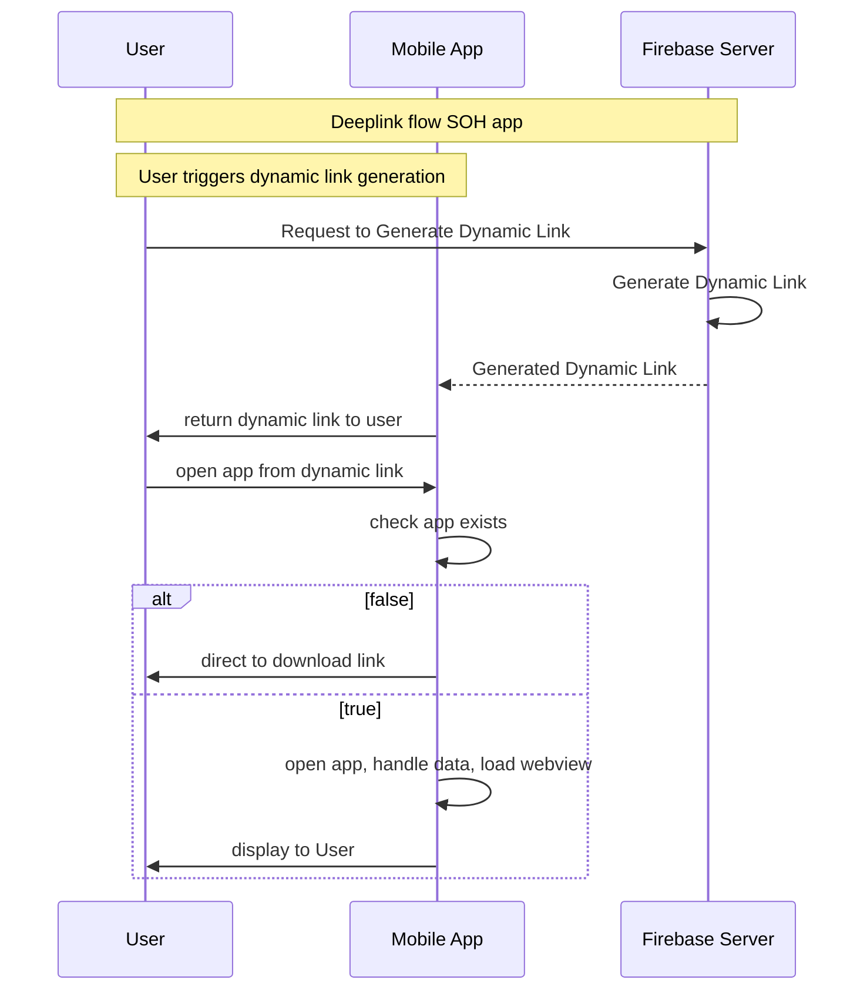

```mermaid
sequenceDiagram
    participant User as User
    participant MobileApp as Mobile App
    participant FirebaseServer as Firebase Server

    Note over User, FirebaseServer: Deeplink flow SOH app
    Note over User, MobileApp: User triggers dynamic link generation

    User->>FirebaseServer: Request to Generate Dynamic Link
    FirebaseServer->>FirebaseServer: Generate Dynamic Link
    FirebaseServer-->>MobileApp: Generated Dynamic Link
    MobileApp->>User: return dynamic link to user

    User->>MobileApp: open app from dynamic link

    MobileApp->>MobileApp: check app exists
    alt false 
    MobileApp->>User: direct to download link
    else true
    MobileApp->>MobileApp: open app, handle data, load webview
    MobileApp->>User: display to User
    end


```
