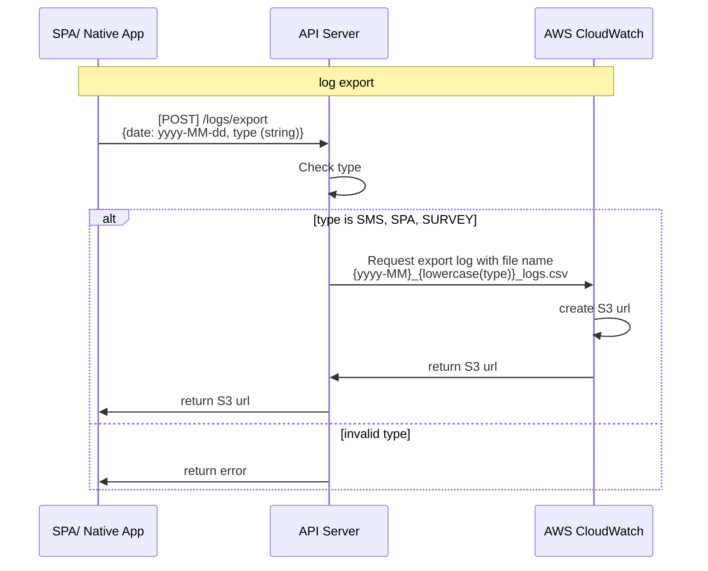

```mermaid
sequenceDiagram    
    participant Webapp as SPA/ Native App
    participant Server as API Server 
    participant AC as AWS CloudWatch

    Note over Webapp, AC: log export

    Webapp->>Server: [POST] /logs/export <br> {date: yyyy-MM-dd, type (string)}
    Server->>Server: Check type
    alt type is SMS, SPA, SURVEY
    Server->>AC: Request export log with file name <br> {yyyy-MM}_{lowercase(type)}_logs.csv
    AC->>AC: create S3 url 
    AC->>Server: return S3 url
    Server->>Webapp: return S3 url
    else invalid type
    Server->>Webapp: return error
    end
```
