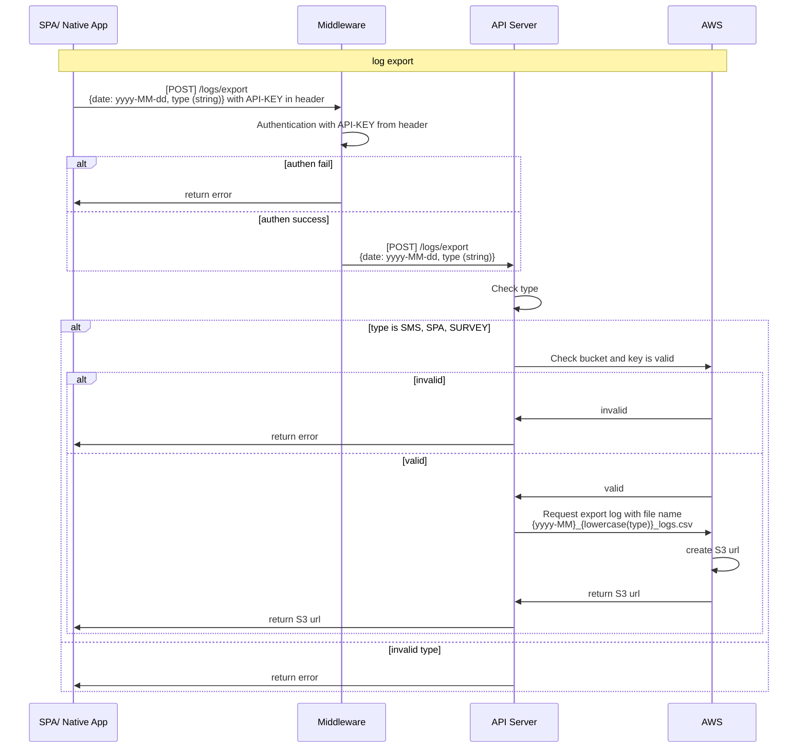

```mermaid
sequenceDiagram    
    participant Webapp as SPA/ Native App
    participant md as Middleware
    participant Server as API Server 
    participant AC as AWS

    Note over Webapp, AC: log export

    Webapp->>md: [POST] /logs/export <br> {date: yyyy-MM-dd, type (string)} with API-KEY in header

    md->>md: Authentication with API-KEY from header
    alt authen fail
    md->>Webapp: return error
    else authen success
    md->>Server: [POST] /logs/export <br> {date: yyyy-MM-dd, type (string)}
    end

    Server->>Server: Check type
    alt type is SMS, SPA, SURVEY
    Server->>AC: Check bucket and key is valid

    alt invalid
    AC->>Server: invalid
    Server->>Webapp: return error
    else valid
    AC->>Server: valid
    

    Server->>AC: Request export log with file name <br> {yyyy-MM}_{lowercase(type)}_logs.csv
    AC->>AC: create S3 url 
    AC->>Server: return S3 url
    Server->>Webapp: return S3 url
    end
    else invalid type
    Server->>Webapp: return error
    end
     
```
