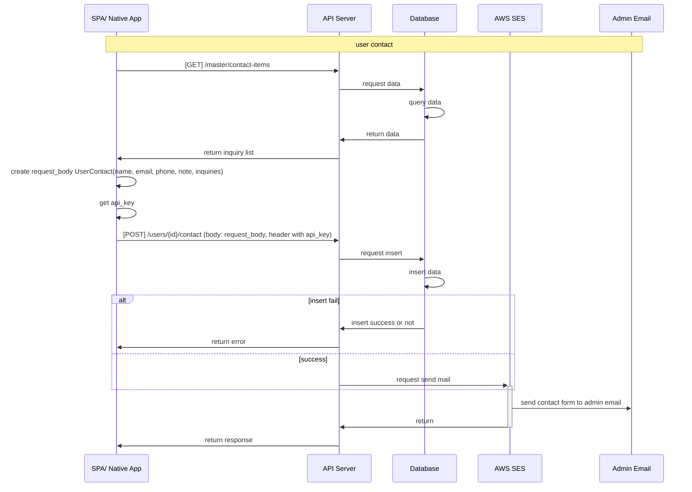

```mermaid
sequenceDiagram    
    participant Webapp as SPA/ Native App
    participant Server as API Server 
    participant DB as Database
    participant AS as AWS SES
    participant AE as Admin Email

    Note over Webapp, AE: user contact

    Webapp->>Server: [GET] /master/contact-items
    Server->>DB: request data
    DB->>DB: query data
    DB->>Server: return data
    Server->>Webapp: return inquiry list

    Webapp->>Webapp: create request_body UserContact(name, email, phone, note, inquiries)
    Webapp->>Webapp: get api_key
    Webapp->>Server: [POST] /users/{id}/contact (body: request_body, header with api_key)
    Server->>DB: request insert
    DB->>DB: insert data
    alt insert fail
    DB->> Server: insert success or not
    Server->>Webapp: return error
    else success

    Server->>+ AS: request send mail
    end
    AS->>AE: send contact form to admin email
    AS->>- Server: return 
    Server->> Webapp: return response
```