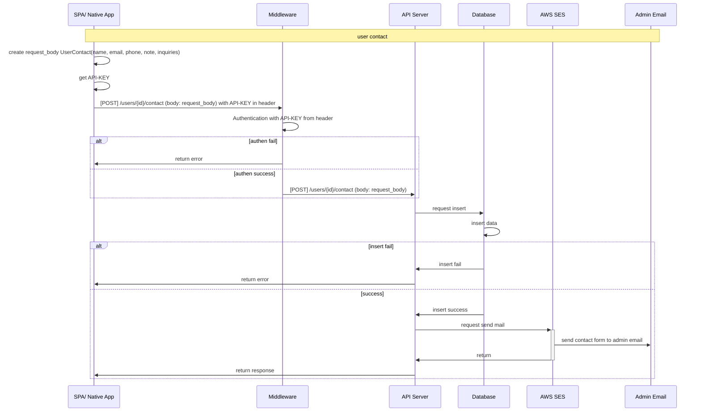

```mermaid
sequenceDiagram    
    participant Webapp as SPA/ Native App
    participant md as Middleware
    participant Server as API Server 
    participant DB as Database
    participant AS as AWS SES
    participant AE as Admin Email

    Note over Webapp, AE: user contact

    Webapp->>Webapp: create request_body UserContact(name, email, phone, note, inquiries)
    Webapp->>Webapp: get API-KEY
    Webapp->>md: [POST] /users/{id}/contact (body: request_body) with API-KEY in header

    md->>md: Authentication with API-KEY from header
    alt authen fail
    md->>Webapp: return error
    else authen success
    md->>Server: [POST] /users/{id}/contact (body: request_body)
    end


    Server->>DB: request insert
    DB->>DB: insert data
    alt insert fail
    DB->> Server: insert fail
    Server->>Webapp: return error
    else success
    DB->> Server: insert success
    Server->>+ AS: request send mail
    AS->>AE: send contact form to admin email
    AS->>- Server: return 
    Server->> Webapp: return response
    end
```
