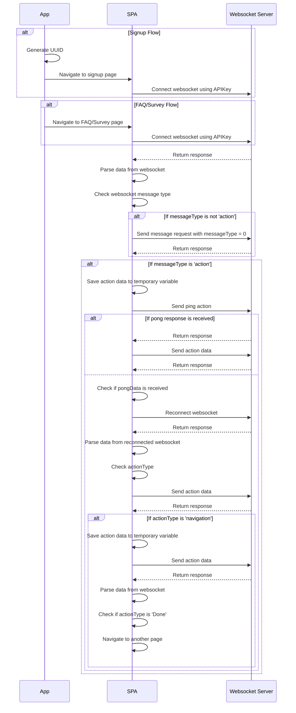

```mermaid
sequenceDiagram
    participant n as App
    participant s as SPA
    participant a as Websocket Server
    
    alt Signup Flow
        n ->> n: Generate UUID
        n ->> s: Navigate to signup page
        s ->> a: Connect websocket using APIKey
    end
    
    alt FAQ/Survey Flow
        n ->> s: Navigate to FAQ/Survey page
        s ->> a: Connect websocket using APIKey
    end
    
    a -->> s: Return response
    s ->> s: Parse data from websocket
    s ->> s: Check websocket message type
    
    alt If messageType is not 'action'
        s ->> a: Send message request with messageType = 0
        a -->> s: Return response
    end
    
    alt If messageType is 'action'
        s ->> s: Save action data to temporary variable
        s ->> a: Send ping action
        alt If pong response is received
            a -->> s: Return response
            s ->> a: Send action data
            a -->> s: Return response
        else
            s ->> s: Check if pongData is received
            s ->> a: Reconnect websocket
            a -->> s: Return response
            s ->> s: Parse data from reconnected websocket
            s ->> s: Check actionType
            s ->> a: Send action data
            a -->> s: Return response
            alt If actionType is 'navigation'
                s ->> s: Save action data to temporary variable
                s ->> a: Send action data
                a -->> s: Return response
                s ->> s: Parse data from websocket
                s ->> s: Check if actionType is 'Done'
                s ->> s: Navigate to another page
            end
        end
    end

```